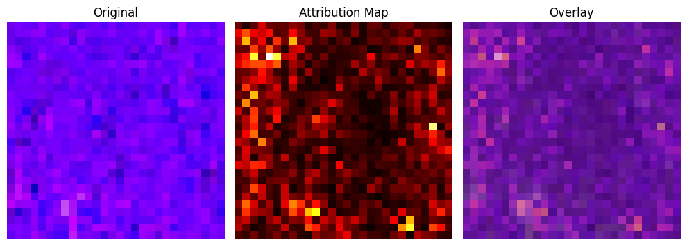
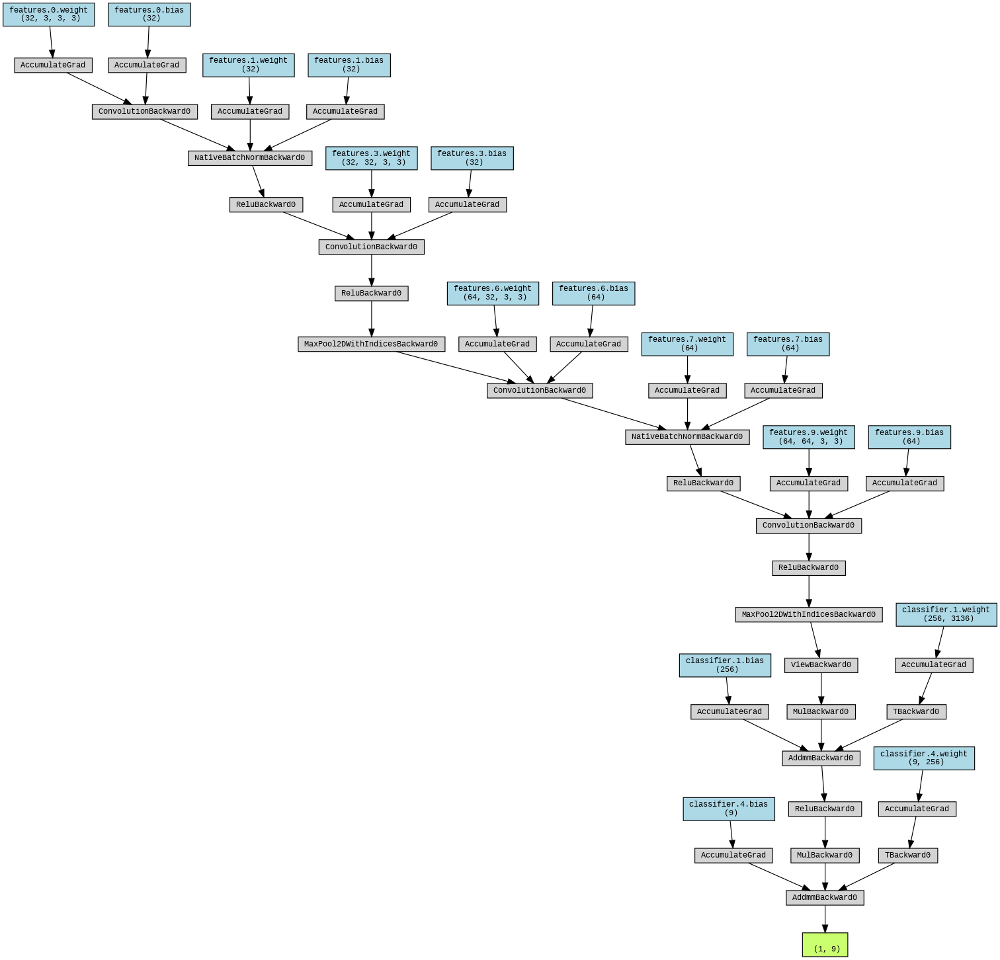
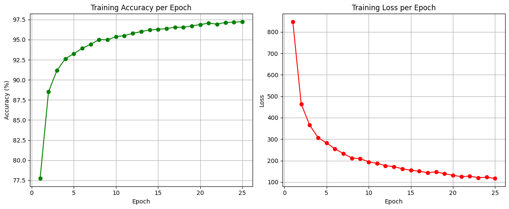

# PathMNIST Explainable Deep Learning Model 🚀

A **lightweight yet high-performing CNN model** designed for the **PathMNIST medical imaging dataset**.  
This model integrates **explainable AI (XAI)** techniques using **Integrated Gradients** for transparent decision-making, while also leveraging **SQLite for scalable attribution storage**.

With **over 91% test accuracy** and **97% training accuracy**, the model demonstrates **state-of-the-art efficiency, scalability, and explainability** in pathology image classification.

---

## 🔍 Introduction & Overview

Medical image classification is critical for **computer-aided diagnosis (CAD)**. However, black-box models often lack **interpretability**, limiting trust in clinical adoption.

This project introduces an **improved CNN architecture** with **explainability baked in**:

- Trained on the **PathMNIST dataset** (107,180 images).  
- Achieved **91.14% test accuracy** in just 25 epochs.  
- Uses **Captum’s Integrated Gradients** for interpretable attributions.  
- Stores explanations in a **scalable SQLite database** for downstream analysis.  

👉 **Keywords:** AI Model, Deep Learning, CNN, Scalable AI, Lightweight Model, Medical Imaging, Explainable AI, Pathology, Integrated Gradients, SQLite  

---

## ⚡ Key Features

- ✅ **High Accuracy**: 97.11% training, 91.14% test accuracy.  
- ✅ **Lightweight & Scalable**: Efficient CNN architecture deployable on edge and HPC systems.  
- ✅ **Explainability Built-in**: Integrated Gradients for transparent predictions.  
- ✅ **Data Augmentation**: Horizontal flips & rotations improve generalization.  
- ✅ **Scalable Attribution Storage**: Explanations stored in **SQLite** for reproducibility.  
- ✅ **Early Stopping + Scheduler**: Prevents overfitting, ensures stable training.  

---

## 📈 Results & Benchmarks

- **Final Test Accuracy**: **91.14%**  
- **Peak Training Accuracy**: **97.11%**  
- Outperforms baseline CNNs for PathMNIST while maintaining **lightweight scalability**.  

| Metric             | Our Model |
| ------------------ | --------- |
| Training Accuracy  | 97.11%    |
| Test Accuracy      | 91.14%    |
| Epochs             | 25        |
| Explainability     | ✅ IG Maps |
| DB Storage Support | ✅ SQLite  |

---

## 🏗️ Model Architecture



The architecture includes:

- Convolutional blocks with **BatchNorm + ReLU** for stability.  
- **Dropout layers** for regularization.  
- **Fully connected layers** for robust classification into 9 classes.  

---

## 📊 Training Performance

Training ran for **25 epochs** with augmentation, Adam optimizer, and ReduceLROnPlateau scheduler.

  

- Accuracy improved from **77.03% → 97.11%** during training.  
- Loss decreased consistently, showing strong convergence.  

---

## ⚙️ Installation & Usage

### 1️⃣ Clone Repository
```bash
git clone https://github.com/ShreyaVijaykumar/PathMNIST-XAI-Lightweight-Explainable-CNN-for-Medical-Imaging
cd pathmnist-explainable-cnn
```

### 2️⃣ Install Requirements
```bash
pip install -r requirements.txt
```

### 3️⃣ Run Training
```bash
python train.py
```

### 4️⃣ Run Evaluation + Explanations
```bash
python evaluate.py
```

---
## 🔑 Keywords
#AI #DeepLearning #ExplainableAI #XAI #CNN #MedicalAI #Pathology #MedicalImaging  
#PyTorch #PathMNIST #LightweightAI #ScalableAI #EdgeAI #OpenSourceAI #MLforHealth  
#IntegratedGradients #Captum #DatabaseAI #SQLite #HealthcareAI #ComputerVision  

